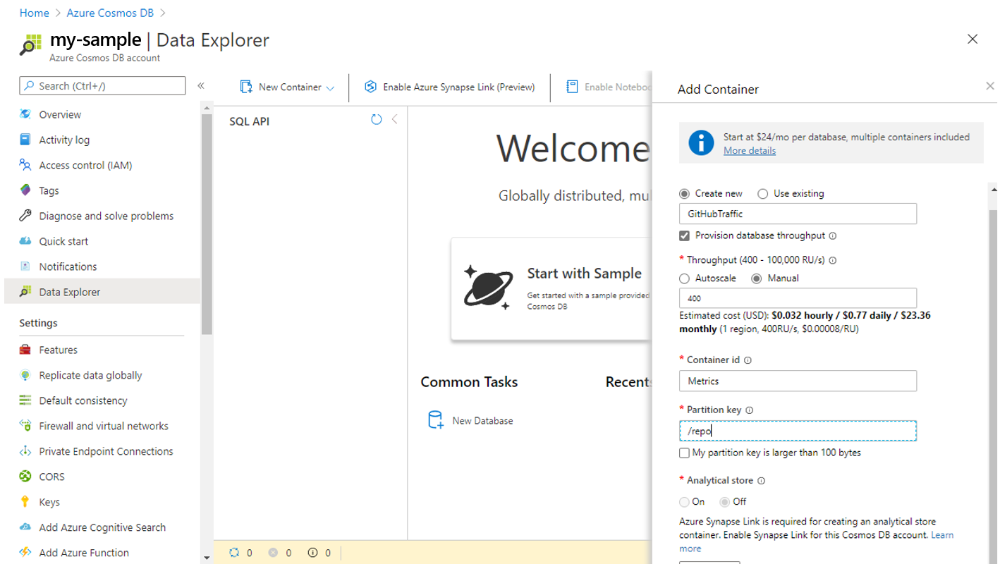
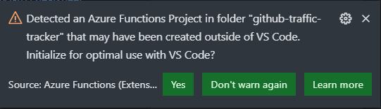
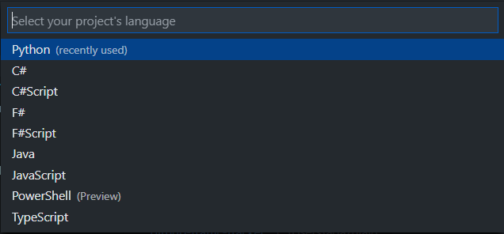

# GitHub Traffic Tracking

<!-- 
Guidelines on README format: https://review.docs.microsoft.com/help/onboard/admin/samples/concepts/readme-template?branch=master

Guidance on onboarding samples to docs.microsoft.com/samples: https://review.docs.microsoft.com/help/onboard/admin/samples/process/onboarding?branch=master

Taxonomies for products and languages: https://review.docs.microsoft.com/new-hope/information-architecture/metadata/taxonomies?branch=master
-->

GitHub offers insights about the traffic activity in your repository, but that data is only available for 14 days. Using a Python Azure Function and Cosmos DB you can quickly capture this data and keep it for as long as you need.

## Contents

Outline the file contents of the repository. It helps users navigate the codebase, build configuration and any related assets.

| File/folder       | Description                                |
|-------------------|--------------------------------------------|
| `github_tracker`  | Sample Azure Function                      |
| `.funcignore`     | Azure Function Artifact                    |
| `host.json`       | Azure Function Artifact                    |
| `proxies.json`    | Azure Function Artifact                    |
| `requirements.txt`| Python dependencies                        |
| `.gitignore`      | Define what to ignore at commit time.      |
| `CHANGELOG.md`    | List of changes to the sample.             |
| `CONTRIBUTING.md` | Guidelines for contributing to the sample. |
| `README.md`       | This README file.                          |
| `LICENSE`         | The license for the sample.                |

## Prerequisites

1. Azure account - [Sign up for free](https://azure.microsoft.com/en-us/free)
1. [VS Code installed](https://code.visualstudio.com)
1. Have [Azure Functions](vscode:extension/ms-azuretools.vscode-azurefunctions) and [Python](vscode:extension/ms-python.python) extensions for VS Code installed

## Running the Code

### Provision Resources in Azure

#### Create an Azure Cosmos DB account

Go to the [Azure portal](https://portal.azure.com/) to create an Azure Cosmos DB account. Search for and select **Azure Cosmos DB**.


1. Select **Add**.
1. On the **Create Azure Cosmos DB Account** page, enter the basic settings for the new Azure Cosmos account.

    |Setting|Value|Description |
    |---|---|---|
    |Subscription|Subscription name|Select the Azure subscription that you want to use for this Azure Cosmos account. |
    |Resource Group|Resource group name|Select a resource group, or select **Create new**, then enter a unique name for the new resource group. |
    |Account Name|A unique name|Enter a name to identify your Azure Cosmos account. Because *documents.azure.com* is appended to the name that you provide to create your URI, use a unique name.<br><br>The name can only contain lowercase letters, numbers, and the hyphen (-) character. It must be between 3-31 characters in length.|
    |API|The type of account to create|Select **Core (SQL)** to create a document database and query by using SQL syntax.|
    |Apply Free Tier Discount|Apply or Do not apply|With Azure Cosmos DB free tier, you will get the first 400 RU/s and 5 GB of storage for free in an account. Learn more about [free tier](https://azure.microsoft.com/pricing/details/cosmos-db/).|
    |Location|The region closest to you|Select a geographic location to host your Azure Cosmos DB account. Use the location that is closest to you for fastest access to the data.|
    |Account Type|Non-Production|Select **Non-Production**. This is an Azure resource tag setting that tunes the Portal experience but does not affect the underlying Azure Cosmos DB account. You can change this value anytime.|
    |Geo-Redundancy|Disable|Disable global distribution on your account. You can add more regions to your account later.|
    |Multi-region Writes|Disable|Multi-region writes capability allows you to take advantage of the provisioned throughput for your databases and containers across the globe.|
    |Availability Zones|Disable|Availability Zones help you further improve availability and resiliency of your application.|

> *You can have up to one free tier Azure Cosmos DB account per Azure subscription and must opt-in when creating the account. If you do not see the option to apply the free tier discount, this means another account in the subscription has already been enabled with free tier.*  


1. Select **Review + create**. You can skip the **Network** and **Tags** sections.

1. Review the account settings, and then select **Create**. It takes a few minutes to create the account. Wait for the portal page to display **Your deployment is complete**.  

    

1. Select **Go to resource** to go to the Azure Cosmos DB account page.  

    

#### Add a database and a container

You can use the Data Explorer in the Azure portal to create a database and container.

1. Select **Data Explorer** from the left navigation on your Azure Cosmos DB account page, and then select **New Container**.

    You may need to scroll right to see the **Add Container** window.

    

1. In the **Add container** pane, enter the settings for the new container.

    |Setting|Suggested value|Description
    |---|---|---|
    |**Database ID**|GitHubTraffic|Enter *GitHubTraffic* as the name for the new database. Database names must contain from 1 through 255 characters, and they cannot contain `/, \\, #, ?`, or a trailing space. Check the **Provision database throughput** option, it allows you to share the throughput provisioned to the database across all the containers within the database. This option also helps with cost savings. |
    |**Throughput**|400|Leave the throughput at 400 request units per second (RU/s). If you want to reduce latency, you can scale up the throughput later.| 
    |**Container ID**|Metrics|Enter *Metrics* as the name for your new container. Container IDs have the same character requirements as database names.|
    |**Partition key**| /repo| The sample described in this article uses */repo* as the partition key.|

    Don't add **Unique keys** for this example. Unique keys let you add a layer of data integrity to the database by ensuring the uniqueness of one or more values per partition key. For more information, see [Unique keys in Azure Cosmos DB](unique-keys.md).

1. Next, select **Keys** from the left navigation.

1. Copy the *Primary Connection String* you'll need this in the next section.

> *For a more detailed setup follow [this tutorial](https://docs.microsoft.com/en-us/azure/cosmos-db/create-cosmosdb-resources-portal)*  

#### Initialize Function in VS Code

1. Open the repo folder in VS Code
1. When prompted select **Yes**  
    
1. Select **python** from the drop down menu
    
1. Select a local installation of Python 3.8 to create a virtual environment with.
1. Create a file called *local.settings.json*
1. Copy and paste the code below into the file and save it.

    ```json
    {
    "IsEncrypted": false,
    "Values": {
        "AzureWebJobsStorage": "",
        "FUNCTIONS_WORKER_RUNTIME": "python",
        "GithubApiKey": "",
        "CosmosDBConnectionString":""
        }
    }
    ```

1. Follow the steps in [this tutorial](https://help.github.com/en/github/authenticating-to-github/creating-a-personal-access-token) to generate you GitHub api key. 
1. Copy and paste the key into *local.settings.json* in the *GithubApiKey* field
1. Paste the Primary Connection String from the pervious section in the *CosmosDBConnectionString*.
1. Save the file

Next you'll need to update the variable in the code.

1. Open *__init__.py*
1. The list of repositories can be set manually, or data can be retrieved for all repos for the user or organization.
    1. For a manual list of repositories, fill the *repos* dict with the repos you'd like to track

        ```python
        repos = {
        "<REPO-NAME>": "<REPO-URL-EXTENSION>",
        }
        ```

        > **Note:** the url extension must match the url extension for GitHub. For example the extension for this repo is **github-traffic-tracker**.

    1. For all repos for a user or organization, delete the declaration of the `repos` dictionary, and uncomment the lines in the `main` function that retrieve the orgs.

        ```python
        def main(mytimer: func.TimerRequest):
            # Uncomment this to load the repos from GitHub each time
            org = Org("<REPO-OWNER>", os.getenv("GithubApiKey"))
            repos = org.repos()
        ```

        Replace `<REPO-OWNER>` with the GitHub user name or organization name.

        This will retrieve all the repositories for the user, and gather traffic data for all of these.

        > **Note:** by doing this you won't be able to set a human-readable name for the repos in the cosmos database, they will all use the repo name.

1. Add the database and container names when initializing CosmosDB.

    ```python
    cosmos_db = Database(
                os.getenv("CosmosDBConnectionString"),
                "<YOUR-DATABASE-NAME>",
                "<YOUR-CONTAINER-NAME>"
                )
    ```

    >*If you used the name given in the example they are **GitHubTraffic** and **Metrics**.*
1. Add the repo owner

    ```python
    repo = Repo("<REPO-OWNER>", name, url, os.getenv("GithubApiKey"))
    ```

    >*This is likely your username or the name of the organization that this repo belongs to.*

#### Deploy Azure Function

A function app requires an Azure Storage account for data and a [hosting plan](/azure/azure-functions/functions-scale#hosting-plan-support). All of these resources are organized within a single resource group.

1. In the **Azure: Functions** explorer, select the **Deploy to Function App** command, or open the Command Palette (**F1**) and select the **Azure Functions: Deploy to Function App** command. Again, the function app is where your Python project runs in Azure.

    

1. When prompted, select **Create New Function App in Azure**, and provide a name that's unique across Azure (typically using your personal or company name along with other unique identifiers; you can use letters, numbers, and hyphens). If you previously created a Function App, its name appears in this list of options.

1. When prompted, select a Python version and Azure location.

1. The extension performs the following actions, which you can observe in Visual Studio Code popup messages and the **Output** window (the process takes a few minutes):

    - Create a resource group using the name you gave (removing hyphens) in the location you selected.
    - In that resource group, create the storage account, hosting plan, and function app. By default, a [Consumption plan](https://docs.microsoft.com/en-us/azure/azure-functions/functions-scale#consumption-plan) is created. To run your functions in a dedicated plan, you need to [enable publishing with advanced create options](https://docs.microsoft.com/en-us/azure/azure-functions/functions-develop-vs-code).
    - Deploy your code to the function app.

    The **Azure: Functions** explorer also shows progress:

    

1. Once deployment is complete, the Azure Functions extension displays a message with buttons for three additional actions:

    

#### Sync local settings to Azure

The **Upload settings** button in the deployment message popup applies any changes you've made to your *local.settings.json* file to Azure. You can also invoke the command on the **Azure Functions** explorer by expanding the Functions project node, right-clicking **Application Settings**, and selecting **Upload local settings**. You can also use the Command Palette to select the **Azure Functions: Upload Local Settings** command.

Uploading settings updates any existing settings and adds any new settings defined in *local.settings.json*. Uploading doesn't remove any settings from Azure that aren't listed in the local file. To remove those settings, expand the **Applications Settings** node in the **Azure Functions** explorer, right-click the setting, and select **Delete Setting**. You can also edit settings directly on the Azure portal.

To apply any changes you make through the portal or through the **Azure Explorer** to the *local.settings.json* file, right-click the **Application Settings** node and select the **Download remote settings** command. You can also use the Command Palette to select the **Azure Functions: Download Remote Settings** command.

## Local testing

Your code will run automatically at 1 am UTC each day and capture the data from the day before. To test your code locally you can edit the [NCRONTAB](https://docs.microsoft.com/en-us/azure/azure-functions/functions-bindings-timer?tabs=python#ncrontab-expressions) timer to run more frequently. The steps below outline how to do that.

1. Open *function.json*
1. Edit the *"schedule"* entry to _"0 * * * * *"_
    > The code will now run once a minute.
1. Edit the *"schedule"* entry back to _"0 0 1 * * *"_ and save the file

<!-- ## Key concepts

TODO:
Provide users with more context on the tools and services used in the sample. Explain some of the code that is being used and how services interact with each other. -->

## Contributing

This project welcomes contributions and suggestions.  Most contributions require you to agree to a
Contributor License Agreement (CLA) declaring that you have the right to, and actually do, grant us
the rights to use your contribution. For details, visit https://cla.opensource.microsoft.com.

When you submit a pull request, a CLA bot will automatically determine whether you need to provide
a CLA and decorate the PR appropriately (e.g., status check, comment). Simply follow the instructions
provided by the bot. You will only need to do this once across all repos using our CLA.

This project has adopted the [Microsoft Open Source Code of Conduct](https://opensource.microsoft.com/codeofconduct/).
For more information see the [Code of Conduct FAQ](https://opensource.microsoft.com/codeofconduct/faq/) or
contact [opencode@microsoft.com](mailto:opencode@microsoft.com) with any additional questions or comments.
